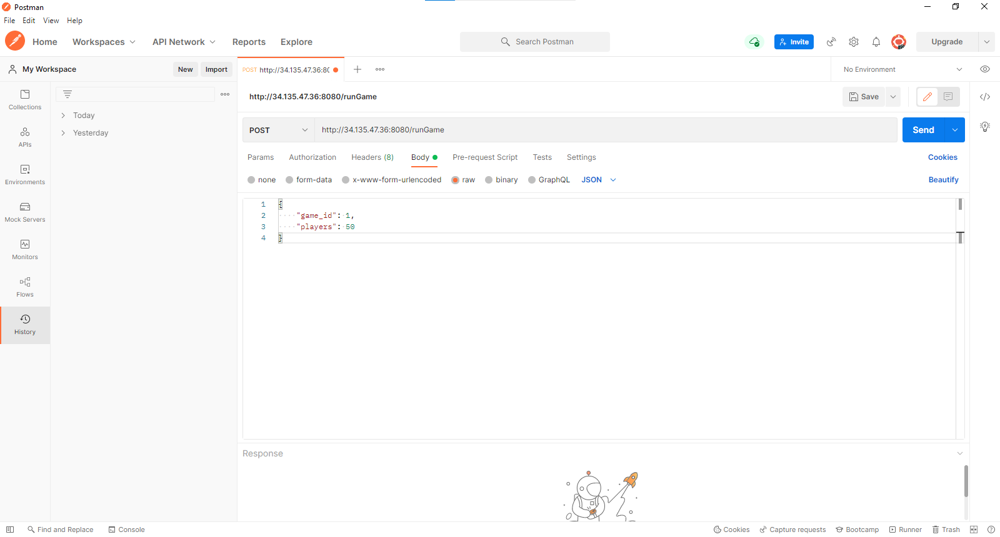
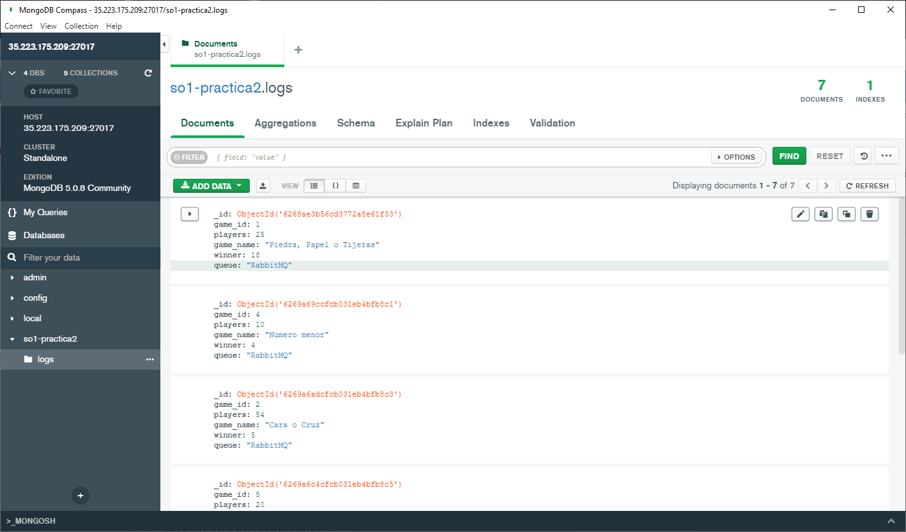

# SO1-Practica2-201900874
La practica fue realiza con la finalidad de conocer el entorno de Kubernetes y comprender su uso, mediante comandos y creacion de archivos. Creando la ruta 1(RabbitMQ) del proyecto utilizando un LoadBalancer para enviar datos desde el cliente de gRPC hasta una instancia con MongoDB

- [SO1-Practica2-201900874](#so1-practica2-201900874)
- [Manual Tecnico](#manual-tecnico)
  - [API - gRPC Client](#api---grpc-client)
  - [gRPC Server - Rabbit Producer](#grpc-server---rabbit-producer)
  - [Rabbit Operator](#rabbit-operator)
  - [Rabbit Subscriber](#rabbit-subscriber)
  - [Configuracion Kubernetes](#configuracion-kubernetes)
- [Manual de Usuario](#manual-de-usuario)
  - [Requerimientos](#requerimientos)
  - [Utilizacion](#utilizacion)
# Manual Tecnico
La ruta de trafico utilizada para la practica se creo haciendo uso de 4 componentes, los cuales son API/gRPC client en Golang, un gRPC Server/Rabbit producer, RabbitMQ operator y un subscriber en Golang. A continuacion se detalla cada uno de los componentes.

## API - gRPC Client
Como el cliente de gRPC se tenia que estar cambiando valores y volver a correr para actualizar la informacion entonces se opto por crear una [API](./grpc-client/) que se encarga de llamar al cliente de gRPC para actualizar los datos y que puedan enviarse al servidor. Para la creacion de la API se utilizo la libreria de Gorilla/mux, la cual cuenta con la ruta "/runGame" y recibe un body de la siguiente forma.

```js
{
    game_id: Number,
    players: Number
}
```

Luego estos datos se ingresan al cliente de gRPC para que pueda enviarlos al servidor y recibir la respuesta esperada. El cliente de gRPC utiliza el archivo [client.proto](./grpc-client/protos/client.proto) para poder definir el metodo al cual se hara la llamada y los datos correspondientes tanto para la peticion como para la respuesta.

Al recibir la respuesta desde el servidor de gRPC se configura la respuesta por parte de la API con el siguiente formato:

```js
{
    status: Number
}
```

De esta forma se sabe si los datos han sido ingresados correctamente para el servidor y que el servidor los ha manejado correctamente para seguir con la funcionalidad.

## gRPC Server - Rabbit Producer
Al hacer una peticion desde el cliente de gRPC los datos enviados son procesados por el servidor y se obtienen mas datos para que sean enviados mediante el producer hacia la cola de Rabbit. Para la comunicacion entre el cliente y servidor se configuro el archivo [server.proto](./grpc-server/protos/server.proto) para que se tenga la misma estructura y no exista discrepancia entre los datos.

En el servidor segun el identificador del juego que se desea simular se hace la llamada al algoritmo correspondiente para definir un ganador, los juegos creados son los siguientes:
- [Piedra, papel o tijera](./grpc-server/helpers/Game1.js), se van realizando varias rondas donde cada uno de los jugadores hace su eleccion y se valida cual ha sido el ganador, asi sucesivamente llegar al ganador final.
- [Cara o cruz](./grpc-server/helpers/Game2.js), se realizan varias rondas para definir al ganador, cada jugador selecciona su opcion y se verifica quien ha sido el ganador de esa ronda.
- [Numero mayor](./grpc-server/helpers/Game3.js), se realiza una reparticion aleatoria de numeros, posteriormente se verifican todos y quien haya obtenido el numero mas grande sera el ganador.
- [Numero menor](./grpc-server/helpers/Game4.js), se realiza una reparticion aleatoria de numeros, posteriormente se verifican todos y quien haya obtenido el numero mas pequeño sera el ganador.
- [Ruleta](./grpc-server/helpers/Game5.js), se va realizando una eliminacion de jugadores hasta que solamente quede uno, quien sera el ganador.

Al obtener el ganador del juego especificado se hace la llamada al Producer de Rabbit para que envie hacia una cola creada en RabbitMQ.

## Rabbit Operator
Es un sistema de colas que funciona como intermediario o bien para el procesamiento de tareas. En este caso funciono como intermediario para poder enviar la informacion desde el producer hasta el subscriber.

Creando una cola con el nombre "GamesQueue", en la cual se iran ingresando y sacando los datos para su utilizacion. Para utilizar RabbitMQ en K8S se hizo uso del Rabbit Operator que se debe de crear en el cluster que estamos trabajando con el siguiente comando.

```sh
kubectl apply -f https://github.com/rabbitmq/cluster-operator/releases/latest/download/cluster-operator.yml
```

Para posteriormente crear un deployment con la imagen de RabbitMQ dentro del namespace de trabajo, se utilizo la siguiente configuracion.

```yaml
apiVersion: rabbitmq.com/v1beta1
kind: RabbitmqCluster
metadata:
  name: rabbitmqcluster
  namespace: practica2-201900874
spec:
  image: rabbitmq:management-alpine
  replicas: 1
  service:
    type: ClusterIP
  rabbitmq:
    additionalConfig: |
      default_user=rabbit
      default_pass=sopes1
```

## Rabbit Subscriber
Como punto final de la ruta se encuentra el [Subscriber de  Rabbit](./rabbit-subscriber/main.go), el cual se conecta hacia el deployment de Rabbit para obtener los datos que se encuentran dentro de la cola y poder enviarlos hacia la instancia de MongoDB. Se crea la conexion hacia Rabbit en modo consumidor hacia la cola "GamesQueue" y se mantiene escuchando nuevos ingresos de datos que se realicen para estar constantemente almacenando la informacion en MongoDB.

## Configuracion Kubernetes
Para poder utilizar todos estos archivos en kubernetes se utilizo Docker Registry para crear las imagenes de los archivos y poder descargarlos en el cluster, las imagenes creadas son las siguientes.

- [API/gRPC Client](https://hub.docker.com/r/curtex19/client_grpc_201900874)
- [gRPC Server/Rabbit Producer](https://hub.docker.com/r/curtex19/server_grpc_201900874)
- [Rabbit Subscriber](https://hub.docker.com/r/curtex19/rabbit_subscriber_201900874)

De este modo al crear los servicios necesarios en kubernetes se dirige hacia [Docker Hub](https://hub.docker.com) en buscada de las imagenes y al encontrarlas las descarga y levanta un contenedor.

Se utilizo el siguiente archivo de configuracion, en el cual se encuentra todo lo necesario para un correcto funcionamiento de la ruta.

```yaml
apiVersion: v1 # SE CREA EL NAMESPACE DE TRABAJO
kind: Namespace
metadata:
  creationTimestamp: null
  name: practica2-201900874
spec: {}
status: {}
---
apiVersion: rabbitmq.com/v1beta1 # SE CREA EL CLUSTER DE RABBITMQ DE TIPO CLUSTERIP
kind: RabbitmqCluster
metadata:
  name: rabbitmqcluster
  namespace: practica2-201900874
spec:
  image: rabbitmq:management-alpine
  replicas: 1
  service:
    type: ClusterIP
  rabbitmq:
    additionalConfig: |
      default_user=rabbit
      default_pass=sopes1
---
apiVersion: apps/v1 # SE CREA EL DEPLOYMENT DE GRPC (CLIENTE Y SERVIDOR)
kind: Deployment
metadata:
  creationTimestamp: null
  labels:
    app: grpc
  name: grpc
  namespace: practica2-201900874
spec:
  replicas: 1
  selector:
    matchLabels:
      app: grpc
  strategy: {}
  template:
    metadata:
      creationTimestamp: null
      labels:
        app: grpc
    spec:
      containers:
      - image: curtex19/client_grpc_201900874
        name: client-grpc-201900874-5g9kr
        env:
        - name: IP_SERVER
          value: localhost:50051
      - image: curtex19/server_grpc_201900874
        name: server-grpc-201900874-qms2p
        env:
        - name: HOSTNAME_RABBIT
          value: rabbitmqcluster
status: {}
---
apiVersion: v1 # SE CREA UN POD CON EL SUBSCRIBER DE RABBIT
kind: Pod
metadata:
  creationTimestamp: null
  labels:
    run: subscriber
  name: subscriber
  namespace: practica2-201900874
spec:
  containers:
  - image: curtex19/rabbit_subscriber_201900874
    name: subscriber
    env:
    - name: RABBIT_HOST
      value: rabbitmqcluster
    - name: HOSTIP_MONGO
      value: 34.71.125.195
  dnsPolicy: ClusterFirst
  restartPolicy: Never
status: {}
---
apiVersion: v1 # SE EXPONE MEDIANTE UN SERVICIO LOADBALANCER EL DEPLOYMENT DE GRPC
kind: Service
metadata:
  creationTimestamp: null
  labels:
    app: grpc
  name: grpc
  namespace: practica2-201900874
spec:
  ports:
  - port: 8080
    protocol: TCP
    targetPort: 8080
  selector:
    app: grpc
  type: LoadBalancer
status:
  loadBalancer: {}

```

# Manual de Usuario
El programa trata sobre un simulador de juegos, el cual posee implementado 5 juegos diferentes y se pueden elegir la cantidad de jugadores. Al finalizar la simulacion de juegos se podra visualizar los datos obtenidos y almacenados en la base de datos.

## Requerimientos
- Tener instalado MongoDB Compass
- Poseer una cuenta en cualquier proveedor de la nube
- Tener creado un cluster de kubernetes.
- Tener instalado un cliente de peticion (Postman)

## Utilizacion
Es necesario tener el cluster de kubernetes creado en el cual se va administrar toda la ruta.

Al tener creado el cluster es necesario crear un archivo .yaml con la siguiente informacion, modificando solamente la IP de la variable de entorno "HOSTIP_MONGO" para el pod llamado "subscriber".

```yaml
apiVersion: v1 # SE CREA EL NAMESPACE DE TRABAJO
kind: Namespace
metadata:
  creationTimestamp: null
  name: practica2-201900874
spec: {}
status: {}
---
apiVersion: rabbitmq.com/v1beta1 # SE CREA EL CLUSTER DE RABBITMQ DE TIPO CLUSTERIP
kind: RabbitmqCluster
metadata:
  name: rabbitmqcluster
  namespace: practica2-201900874
spec:
  image: rabbitmq:management-alpine
  replicas: 1
  service:
    type: ClusterIP
  rabbitmq:
    additionalConfig: |
      default_user=rabbit
      default_pass=sopes1
---
apiVersion: apps/v1 # SE CREA EL DEPLOYMENT DE GRPC (CLIENTE Y SERVIDOR)
kind: Deployment
metadata:
  creationTimestamp: null
  labels:
    app: grpc
  name: grpc
  namespace: practica2-201900874
spec:
  replicas: 1
  selector:
    matchLabels:
      app: grpc
  strategy: {}
  template:
    metadata:
      creationTimestamp: null
      labels:
        app: grpc
    spec:
      containers:
      - image: curtex19/client_grpc_201900874
        name: client-grpc-201900874-5g9kr
        env:
        - name: IP_SERVER
          value: localhost:50051
      - image: curtex19/server_grpc_201900874
        name: server-grpc-201900874-qms2p
        env:
        - name: HOSTNAME_RABBIT
          value: rabbitmqcluster
status: {}
---
apiVersion: v1 # SE CREA UN POD CON EL SUBSCRIBER DE RABBIT
kind: Pod
metadata:
  creationTimestamp: null
  labels:
    run: subscriber
  name: subscriber
  namespace: practica2-201900874
spec:
  containers:
  - image: curtex19/rabbit_subscriber_201900874
    name: subscriber
    env:
    - name: RABBIT_HOST
      value: rabbitmqcluster
    - name: HOSTIP_MONGO
      value: 34.71.125.195
  dnsPolicy: ClusterFirst
  restartPolicy: Never
status: {}
---
apiVersion: v1 # SE EXPONE MEDIANTE UN SERVICIO LOADBALANCER EL DEPLOYMENT DE GRPC
kind: Service
metadata:
  creationTimestamp: null
  labels:
    app: grpc
  name: grpc
  namespace: practica2-201900874
spec:
  ports:
  - port: 8080
    protocol: TCP
    targetPort: 8080
  selector:
    app: grpc
  type: LoadBalancer
status:
  loadBalancer: {}
```

Al tener creado el archivo, nos debemos de dirigir hacia la ruta en la cual creamos el archivo y ejecutar el siguiente comando para que kubernetes se encargue del resto. Luego de ejecutar el comando esperamos un minuto en lo que se crean todos los archivos

```sh
kubectl create -f nombre.yaml
```

Al terminar kubernetes de levantar todos los servicios debemos de buscar la IP que se nos asigno para el balanceador de carga, esto lo realizamos con el siguiente comando.

```sh
kubectl get svc
```

Apareceran algunos servicios pero el que nos interesa es el de tipo LoadBalancer, copiamos la IP asignada y la ingresamos dentro de nuestro cliente de peticiones de la siguiente manera.



Luego solamente le damos en enviar a la peticion y esperamos la respuesta por parte del deployment de gRPC, la cual deberia de aparecer de la siguiente forma.

```js
{
    status: 1
}
```

Y por ultimo se podra visualizar con MongoDB Compass los logs creados por parte del servidor.

